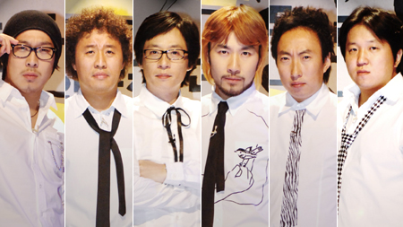
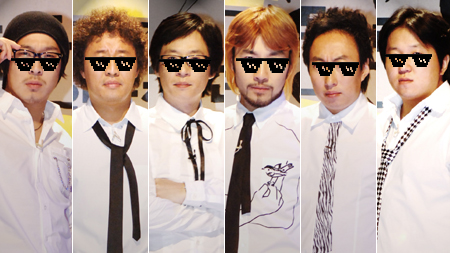

# Overlay sunglasses with CNN(Caffe)

https://github.com/sr6033/face-detection-with-OpenCV-and-DNN
<br>

해당 깃허브를 참고했습니다.

## Caffe

- 컴퓨터 비전에 사용되는 딥러닝 프레임워크 중 하나로, Berkeley AI Research(BAIR)에서 개발한 오픈 소스 라이브러리
- Caffe는 Convolutional Architecture for Fast Feature Embedding의 약자로, 합성곱 신경망(Convolutional Neural Network, CNN)을 위한 설계와 최적화가 주된 목표
- OpenCV는 Caffe와의 통합을 지원하여, Caffe에서 학습된 딥 러닝 모델을 불러와 사용할 수 있음
- Caffe를 사용하니, 단순히 OpenCV만 사용했을 때보다 더 정확하게 얼굴을 인식했음

## 얼굴 인식 후 선글라스 씌우기

### 코드 실행 전



사진 출처 : https://www.wolyo.co.kr/news/articleView.html?idxno=9615

### 코드 실행 후



<hr>

### 이미지 사용 시

사진 속 사람이 혼자일 때, dnn_image_sunglasses.py 이용

```
# 실행 명령어
$ python dnn_image_sunglasses.py -i input_folder/image.png -p deploy.prototxt.txt -m res10_300x300_ssd_iter_140000.caffemodel -g sunglasses_image.png -s 1.0 --height_scale 0.2 --x_offset 0 --y_offset -10 -o output_folder
```

<br>

사진 속 사람이 다수일 때, dnn_image_group_sunglasses.py 이용

```
# 실행 명령어
$ python dnn_image_group_sunglasses.py -i input_folder/group.jpg -p deploy.prototxt.txt -m res10_300x300_ssd_iter_140000.caffemodel -g sunglasses_image.png -s 1.0 --height_scale 0.2 --x_offset 0 --y_offset -10 -o output_folder
```

<br>

### 비디오 이용 시

dnn_video_sunglasses.py 이용

```
# 실행 명령어
$ python dnn_video_sunglasses.py -i 0 -o output_folder -s 1.0 -g sunglasses_image.png -p deploy.prototxt.txt -m res10_300x300_ssd_iter_140000.caffemodel
```
